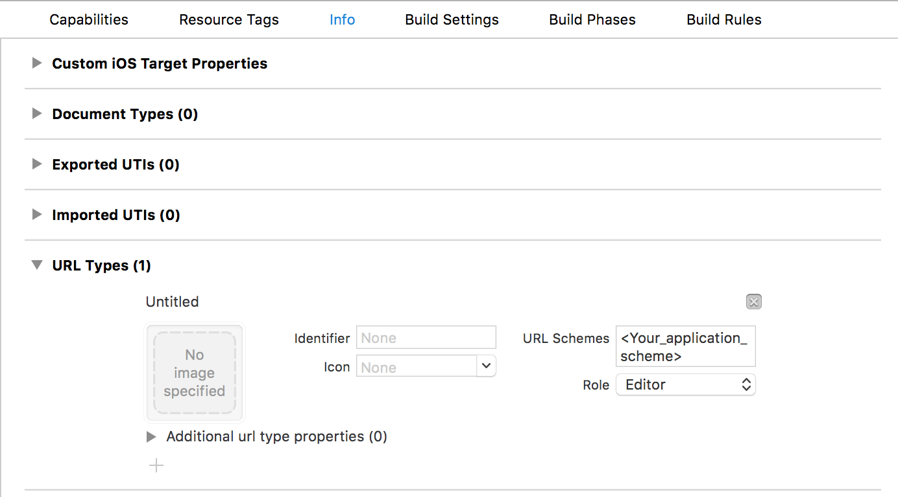

# Withings-SDK-iOS

[](https://travis-ci.org/jdrevet/Withings-SDK-iOS)
[](https://github.com/jdrevet/Withings-SDK-iOS/releases/latest)
[](https://cocoapods.org/pods/Withings-SDK-iOS)
[](https://cocoapods.org/pods/Withings-SDK-iOS)
[](https://raw.githubusercontent.com/jdrevet/Withings-SDK-iOS/master/LICENSE)


## Overview

Withings-SDK-iOS provides an Objective-C interface for integrating iOS apps with the [Withings API](http://oauth.withings.com/api). It handles OAuth 1.0 authentication using [OAuthSwift library](https://github.com/OAuthSwift/OAuthSwift).


## Features

For now, the SDK implements the following Withings API:
- [Get Activity Measures](http://oauth.withings.com/api/doc#api-Measure-get_activity)
- [Get Body Measures](http://oauth.withings.com/api/doc#api-Measure-get_measure)
- [Get Sleep Measures](http://oauth.withings.com/api/doc#api-Measure-get_sleep)

The following features will be added in the future:
- [Get Sleep Summary](http://oauth.withings.com/api/doc#api-Measure-get_sleep_summary)
- [Get Workouts](http://oauth.withings.com/api/doc#api-Measure-get_workouts)
- [Get Intraday Activity](http://oauth.withings.com/api/doc#api-Measure-get_intraday_measure) (which need a special activation to access)


## Requirements

Withings-SDK-iOS requires iOS 8.0 and above.


In order to use the API, you will need to register as a developer [here](https://oauth.withings.com/partner/add) to get a consumer key and secret. Note that you will also need to have an end-user Withings account to test data fetching.


Several third-party open source libraries, all under MIT license, are used within Withings-SDK-iOS:

1. [OAuthSwift](https://github.com/OAuthSwift/OAuthSwift) - OAuth support
2. [DCKeyValueObjectMapping](https://github.com/dchohfi/KeyValueObjectMapping) - JSON mapping
3. [SAMKeyChain](https://github.com/soffes/SAMKeychain) - Keychain wrapper


## Installation

### Installation with CocoaPods

To integrate Withings-SDK-iOS into your project using [CocoaPods](https://cocoapods.org/), add the following lines in your `Podfile`:

```ruby
platform :ios, '8.0'
use_frameworks!

pod 'Withings-SDK-iOS'
```

Then, run the following command:

```bash
$ pod install
```


## Usage

### SDK setup

Before any other call, set up the shared `WithingsAPI` object with your application keys. For example, you can set up the SDK in the method `application:didFinishLaunchingWithOptions:` in your AppDelegate.
```obj-c
// AppDelegate.m

- (BOOL)application:(UIApplication *)application didFinishLaunchingWithOptions:(NSDictionary *)launchOptions
{
    NSString *consumerKey = @"<Your consumer key>";
    NSString *consumerSecret = @"<Your consumer secret>";
    [[WithingsAPI sharedInstance] setUpWithConsumerKey:consumerKey consumerSecret:consumerSecret];
    return YES;
}
```
To get your keys, register as a developer [here](https://oauth.withings.com/partner/add).

### Callback management

During the OAuth 1.0 authentication process, the user will be redirect to a web page managed by Withings to authorize your application to access to his resources. Your application should be configured to handle the callback called at the end of the process.

1. Declare an URL scheme for your application.


2. In your AppDelegate, implement `application:openURL:` and call `handleOpenURL:` on the shared `WithingsAPI` object.
```obj-c
// AppDelegate.m

- (BOOL)application:(UIApplication *)app openURL:(NSURL *)url options:(NSDictionary<NSString *,id> *)options
{
    [[WithingsAPI sharedInstance] handleOpenURL:url];
    return YES;
}
```
Do not forget the deprecated method to manage the callbacks on iOS 8.0.
```obj-c
// AppDelegate.m

- (BOOL)application:(UIApplication *)application openURL:(NSURL *)url sourceApplication:(nullable NSString *)sourceApplication annotation:(id)annotation
{
    [[WithingsAPI sharedInstance] handleOpenURL:url];
    return YES;
}
```

### Request user authorization

Request the user authorization by calling the following method. The user will be redirect to a web page provided by Withings to authorize your application to access to his resources.
```obj-c
// SomeViewController.h

[[WithingsAPI sharedInstance] requestAccessAuthorizationWithCallbackScheme:@"<Your application scheme>" presenterViewController:self success:^(NSString *userId) {
	//Persist the user id to be able to request Withings API without requesting again the user authorization
} failure:^(WithingsError *error) {
    //Manage the error
}];
```

### Call APIs

Once you have user authorization, you can call any API provided by the API client. You can manage one or more instance of clients or simply use the instance of client held by the `WithingsAPI` singleton.
For example, to get all the activities measures for an user, call:
```obj-c
// SomeViewController.h

[[WithingsAPI sharedInstance].measureAPIClient getActivitiesMeasuresForUser:@"<The user id>" success:^(NSArray<WithingsActivity *> *activitiesMeasures) {
    //Process the results
} failure:^(WithingsError *error) {
    //Manage the error
}
```

### API Documentation

The complete API documentation is available on [CocoaDocs](http://cocoadocs.org/docsets/Withings-SDK-iOS).


## Author

Johan Drevet


## License

Withings-SDK-iOS is released under the MIT license. See LICENSE for details.
